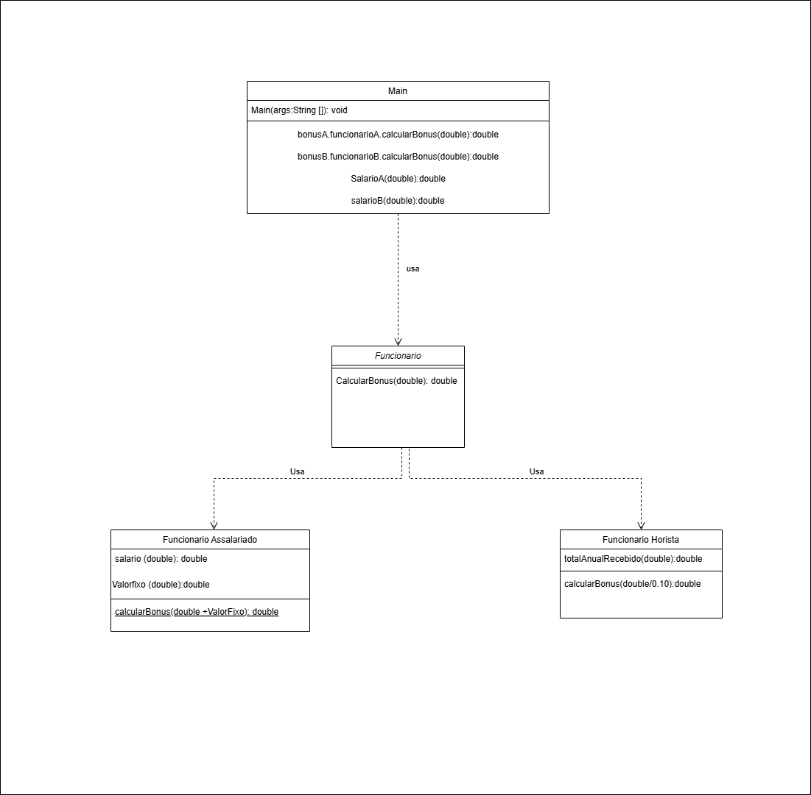

# Classe_Estática

Esta atividade é requisito da Avaliação Continuada 2

## 🚀 Começando


*Crie uma interface chamada Funcionario que defina um método calcularBonus(). Em seguida, crie duas classes que implementem essa interface:

*FuncionarioAssalariado: o bônus é um valor fixo de R$ 5.000,00.

*FuncionarioHorista: o bônus é calculado como 10% do total anual recebido pelo funcionário.

*Após criar as classes, implemente uma classe principal (Main) que crie instâncias dos dois tipos de funcionários e invoque o método calcularBonus() para mostrar o valor do bônus de cada funcionário.

[Diagrama de Classes do Exercício Acima]

()

### 📋 Pré-requisitos

De que coisas você precisa para instalar o software e como instalá-lo?

```
Processador (AMD®, ARM® ou Intel®) de 64 bits.
Por consequência, um sistema operacional de 64 bits;
Espaço em disco suficiente para baixar e instalar os componentes da IDE(Não é muito pesado).


1. Faça o Download do Eclipse Installer.
2. Inicie o Eclipse Installer.
3. Selecione o pacote (Linguagem de Programação) para baixar.
4. Selecione um Local para guardar Downloads.
5. E Pronto!

```

### 🔧 Instalação

Após abrir o pacote com o Arquivo para o programa executar, entre no Arquivo Main, onde estarão todas as informações de Input do programa, após colocar as informações que você quer, é só rodar.

## 🛠️ Construído com

* IDE Eclipse
* JRE System Library

## 📌 Versão

* **Eclipse Installer 2024-09 R
  
